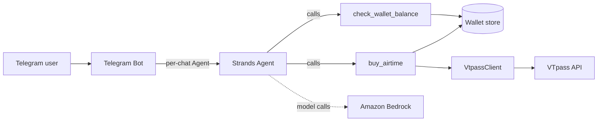

<p align="center">
  
</p>

<h1 align="center">asap-everyday-agent</h1>

<p align="center">
  An agent that buys airtime for you over Telegram. No app, no menu, no confirmation tap.
  <br>
  It only talks back when there's a real decision to make.
</p>

<p align="center">
  <a href="LICENSE"></a>
  
  
  
  <a href="https://agentsforhumans.devpost.com"></a>
</p>

<p align="center">
  Built for AWS's <a href="https://agentsforhumans.devpost.com">Agents for Humans</a> hackathon, Everyday Agents track.
</p>

---

## Table of contents

- [What it does](#what-it-does)
- [Who it's for](#who-its-for)
- [How it works](#how-it-works)
- [Architecture](#architecture)
- [Disclosure](#disclosure)
- [Getting started](#getting-started)
- [Configuration](#configuration)
- [Testing](#testing)
- [Project structure](#project-structure)
- [Out of scope for this submission](#out-of-scope-for-this-submission)
- [License](#license)

## What it does

Message the bot: *"send 500 naira MTN airtime to 08012345678."* If the
details are clear and the wallet can cover it, the airtime is bought
immediately, no confirmation step, no menu, no app. If the wallet's
short, it says so and states the exact shortfall instead of guessing.
If something's ambiguous, it asks exactly one question, not a form.

This is a **working integration**, not a mock: purchases go through
[VTpass](https://vtpass.com), a real Nigerian billing aggregator, with
its full response-code handling ported faithfully, including the trap
where VTpass's `000` response code means "accepted," not "delivered."

## Who it's for

Anyone who tops up airtime regularly, for themselves or someone else,
and is tired of the same handful of taps every time: open the app, pick
a network, type a number, pick an amount, confirm, wait. This collapses
that to one message, answered the moment it's sent.

## How it works

```
"send 500 naira MTN airtime to 08012345678"
        │
        ▼
 check wallet balance
        │
   ┌────┴────┐
   │ funded? │
   └────┬────┘
   yes  │  no
        │
   ┌────┴──────────────────┐
   ▼                        ▼
buy immediately      "you're ₦120 short"
   │                  (no purchase attempted)
   ▼
confirm with tx reference
```

## Architecture

Full breakdown, including exactly what's ported from an existing
production system versus built new for this submission, is in
[`docs/architecture.md`](docs/architecture.md).



## Disclosure

The VTpass response-code handling and purchase-safety rules (the
`000`-isn't-delivered trap, idempotency, reverse-only-when-proven-
uncharged) are reimplemented here from a production system the author
previously built, adapted from JavaScript into a new Python
implementation on Strands Agents SDK. This is the disclosure this
hackathon's own rules ask for when pre-existing work is incorporated
into a submission. No production credential, database, or user data
from that system is used anywhere in this repo; everything here (the
agent, its tools, the wallet store, the Telegram interface) is new work
built for this submission. See
[`docs/architecture.md`](docs/architecture.md) for the full
ported-vs-new breakdown.

## Getting started

**Prerequisites:** Python 3.11+, a [Telegram bot token](https://core.telegram.org/bots#how-do-i-create-a-bot) from BotFather, a [VTpass](https://vtpass.com) account, and AWS credentials with Bedrock model access enabled.

```bash
git clone https://github.com/<your-org>/asap-everyday-agent.git
cd asap-everyday-agent

python -m venv .venv
source .venv/bin/activate   # .venv\Scripts\activate on Windows

pip install -r requirements.txt
cp .env.example .env         # fill in the values, see Configuration below

python -m src.telegram_bot
```

Strands defaults to Amazon Bedrock with Claude as the model provider.
Enable model access for it once, in the Bedrock console, under whichever
AWS account `.env`'s credentials point at.

## Configuration

All variables live in `.env` (see `.env.example` for the full template).

| Variable | Required | Notes |
| --- | --- | --- |
| `TELEGRAM_BOT_TOKEN` | Yes | From [@BotFather](https://t.me/BotFather) |
| `VTPASS_BASE_URL` | Yes | `https://sandbox.vtpass.com` for testing |
| `VTPASS_API_KEY` / `VTPASS_SECRET_KEY` | Yes | A key for **this project**, never a production key from elsewhere |
| `WALLET_DB_PATH` | No | SQLite file path, defaults to `wallet.db` |
| `WALLET_SEED_KOBO` | No | Starting balance for a new chat, in kobo. Defaults to ₦5,000 |
| `AWS_ACCESS_KEY_ID` / `AWS_SECRET_ACCESS_KEY` | Yes | A dedicated AWS account for this hackathon build |

## Testing

```bash
pytest -v
```

10 tests, covering the wallet store (seed, debit, insufficient funds,
idempotency, top-up) and the purchase tool (successful buy, insufficient
funds short-circuiting before the provider is ever called, an
unsupported network, and both failure-reversal paths, reversed only
when VTpass's own response proves nothing was charged, left in place
otherwise, the same rule the source system's production code enforces).

## Project structure

```
asap-everyday-agent/
├── src/
│   ├── agent.py              # the Strands Agent + system prompt (autonomy rule)
│   ├── telegram_bot.py        # Telegram interface, per-chat agent instances
│   ├── tools/
│   │   ├── wallet.py           # check_wallet_balance tool
│   │   └── purchase.py         # buy_airtime tool
│   ├── providers/
│   │   └── vtpass.py           # ported VTpass client
│   └── wallet/
│       └── store.py            # standalone SQLite demo wallet
├── tests/
│   ├── test_wallet_store.py
│   └── test_buy_airtime.py
└── docs/
    ├── architecture.md
    └── assets/icon.svg
```

## Out of scope for this submission

- Data, electricity, and TV purchases: the source system supports all
  three; only airtime is ported here.
- WhatsApp integration: Telegram only, for this submission.
- Real money movement into the wallet: seeded with a demo balance on
  first use (see [`src/wallet/store.py`](src/wallet/store.py)).

## License

[MIT](LICENSE)
