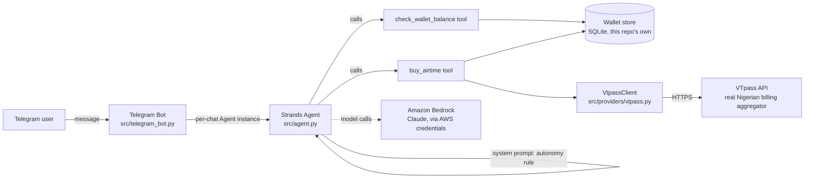

# Architecture

## What was ported from ASAP, and what's new

| Piece | Source |
| --- | --- |
| VTpass response-code classification (`classify()`), the "000 isn't delivered" trap, idempotency handling | Ported from ASAP's `providers/vtpass.js`, reimplemented in Python |
| Debit-then-pay, reverse-only-when-proven-uncharged purchase safety | Ported from ASAP's `jobs/handlers/airtime.js`'s crash-safety logic, adapted from a queued-job model to a synchronous tool call |
| Wallet balance / debit / fund, kobo-denominated | New — a standalone SQLite store for this submission, not a connection to ASAP's production database |
| Autonomy rule (system prompt) | New — this is the actual hackathon deliverable: a plain-language rule the model follows, not scattered checks |
| Telegram bot, per-chat agent instances | New — replaces ASAP's WhatsApp interface for this submission |
| Strands `Agent` + `@tool` wiring | New — this submission's actual use of the Strands Agents SDK |

## Why a synchronous tool call instead of ASAP's job queue

ASAP's real purchase flow is asynchronous: a job gets queued, a worker
claims it, and can retry a crashed attempt because the request id was
recorded before the provider call ever went out. That two-process design
solves a problem this submission doesn't have — there's no separate
worker here to crash independently of the tool call itself. The purchase
tool keeps the part of that design that still matters at this scale (a
deterministic, idempotent reference so a retried tool call can't
double-debit) without the queue infrastructure that would exist purely
to satisfy a judging checklist item rather than solve a real problem
here.

## Deployment

Runs anywhere Python does. For AWS Bedrock AgentCore deployment (the
hackathon's suggested path, strengthens the Technical Implementation
score), see the AWS credentials section in `.env.example` — the agent
code itself doesn't change between local and AgentCore deployment, only
how the process gets hosted.
